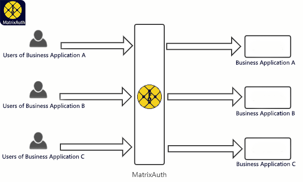
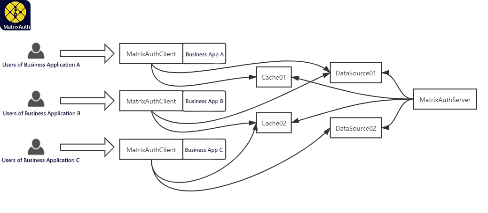

  

# [MatrixAuth](https://github.com/yeecode/MatrixAuth)

High-performance lightweight distributed permission system. 

---

[中文说明](./README_CN.md)

---

## 1 System introduction

MatrixAuth is a high-performance distributed permission system. It implements permission management based on RBAC (role-based access control) model and supports access of multiple business applications.

	

Matrixauth has the following features:

- High performance: the system supports access to dozens of business applications. MatrixAuthClient only needs to query the memory database once to complete the authorization work. It can support 100000 query requests per second for each business application.
- Lightweight: the server of the system can be started directly with jar package. The system client is light and easy to use.
- Multi tenant: the system supports the access of multiple business applications. Each business application can independently use and share the database and cache. Thus, data isolation among tenants is ensured. It can support the access of 100 service applications.
- Scalable: the system can access multiple data sources, and each data source supports cluster expansion; the system can access multiple caches, and each cache supports cluster expansion.
- Security: business calls cannot bypass the system's permission validation mechanism.
- Reliable: there is no single failure point in the system, and the authority setting module, database and cache can be restarted independently without affecting the authorization operation of the business system.
- Easy to use: after simple configuration, the system can use annotations to complete permission configuration. The server has a complete API interface.

## 2 System structure

Matrixauth system mainly consists of MatrixAuthServer, MatrixAuthClient, data source and cache. The relationship between these four parts and business system is shown in the figure below.

	

MatrixAuthServer is the permission management subsystem of MatrixAuth, through which business application management and role permission management can be realized. At the same time, MatrixAuthServer is also responsible for synchronizing various permission setting information into the database and cache.

MatrixAuthClient is a jar package that can be integrated into business applications. After the MatrixAuthClient is integrated into the business application and activated, it will verify the permission of every request entering the business application. Only when the initiator of the request has the relevant permission, the request will be released, otherwise the request will be blocked.

MatrixAuthClient needs to expand permission verification based on the information in the data source. A data source can be used by a business application's MatrixAuthClient alone, or shared by multiple business application's MatrixAuthClient. The business application's MatrixAuthClient can also not configure the data source. At this time, the business application's MatrixAuthClient will use the default data source.

You can configure the cache for MatrixAuthClient to improve its authentication efficiency. Cache configuration does not need to correspond to data sources one by one. The cache can be shared by MatrixAuthClient of one business application or by MatrixAuthClient of multiple business applications.

After the system setting is completed, the user's request to the business application will be verified by MatrixAuthClient in the business application. MatrixAuthClient will first go to the cache set by itself to read the permission information. If the cache is not set or the result is not found in the cache, it will go to the data source to query the permission information. Then, MatrixAuthClient will decide whether the request is released or blocked according to the permission information.

---

For more information, please refer to the MatrixAuth website:[HOME PAGE](http://en.matrixauth.top/)。

For more instructions, please refer to the MatrixAuth document:[DOCUMENTS](http://en.matrixauth.top/docs/)。