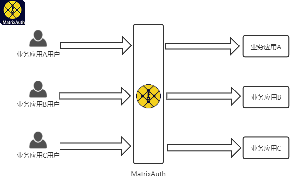
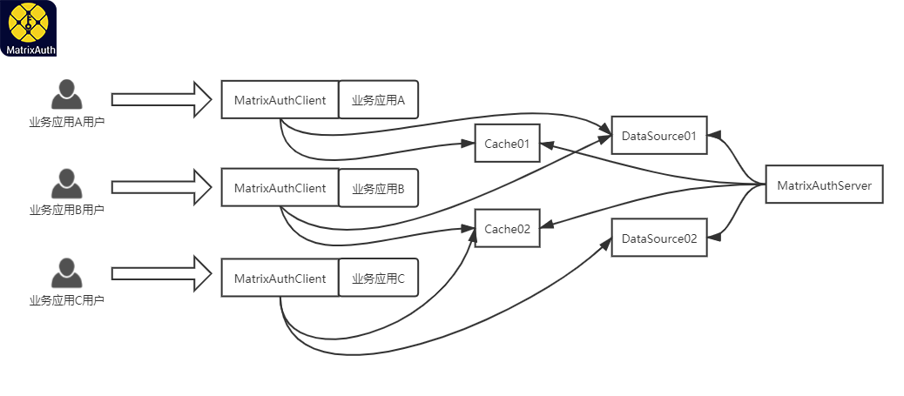

  

# [MatrixAuth](https://github.com/yeecode/MatrixAuth)

高性能轻量级分布式权限系统。

---

[English Introduction](./README.md)

---

## 1 系统简介

MatrixAuth是一个高性能的分布式权限系统，它以RBAC（基于角色的访问控制）模型为基础实现权限管理，支持多个业务应用的接入。

	

MatrixAuth具有以下特点：

- 高性能：系统采用分流、缓存、分库分表、反范式设计等手段设计，具有极高的性能，可以同时支持数十业务应用的接入。MatrixAuthClient只需要查询一次内存数据库便可以完成判权工作。可支持每个业务应用每秒10万次的查询请求。
- 轻量级：系统的服务端可以采用Jar包直接启动。系统客户端轻量易用。
- 多租户：系统支持多个业务应用的接入，各个业务应用之间可以独立使用、共享使用数据库、缓存。从而保证了各租户之间的数据隔离。可支持100个业务应用的接入。
- 可扩展：系统可接入多个数据源，每个数据源支持集群扩展；系统可以接入多个缓存，每个缓存支持集群扩展。
- 安全：业务调用无法绕过系统的权限验证机制。
- 可靠：系统无单故障点，权限设置模块、数据库、缓存均可独立重启而不会对业务系统的验权操作造成影响。
- 易用：系统只需要简单的配置后便可以使用注解完成权限配置。服务端具有完整的API接口。

## 2 系统结构

MatrixAuth系统主要包含MatrixAuthServer、MatrixAuthClient、数据源、缓存四部分组成，这四部分与业务系统的关系如下图所示。

	

MatrixAuthServer是MatrixAuth的权限管理子系统，通过它可以实现业务应用的管理、角色权限的管理等。同时，MatrixAuthServer还负责将各种权限设置信息同步到数据库和缓存中。

MatrixAuthClient是一个可以集成到业务应用中的Jar包。MatrixAuthClient在被集成到业务应用中并被激活之后，会对进入业务应用的每一个请求进行权限验证，只有请求的发起方具有相关权限时请求才会被放行，否则请求会被阻止。

MatrixAuthClient需要基于数据源中的信息展开权限验证。一个数据源可以供一个业务应用的MatrixAuthClient单独使用，也可以供多个业务应用的MatrixAuthClient共用。业务应用的MatrixAuthClient也可以不配置数据源，这时该业务应用的MatrixAuthClient将使用默认数据源。

可以为MatrixAuthClient配置缓存以提升其验权效率。配置缓存时不需要和数据源一一对应。缓存可以供一个业务应用的MatrixAuthClient独享，也可以供多个业务应用的MatrixAuthClient共享。

在系统设置完成后，用户发往业务应用的请求会经过业务应用内的MatrixAuthClient进行权限验证。MatrixAuthClient会优先前往自身设置的缓存读取权限信息，如果未设置缓存或者缓存中未查询到结果，则会前往数据源查询权限信息。然后，MatrixAuthClient会根据权限信息决定该请求是被放行还是被拦截。

---

更多介绍信息可参照MatrixAuth官方网站：[官方网站 matrixauth.top](http://matrixauth.top/)。

更多使用说明可参见MatrixAuth官方文档：[官方文档 matrixauth.top/docs/](http://matrixauth.top/docs/)。